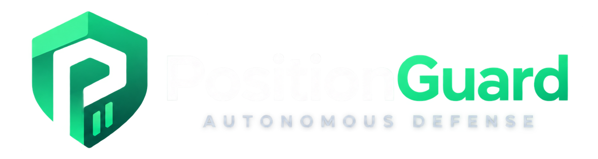
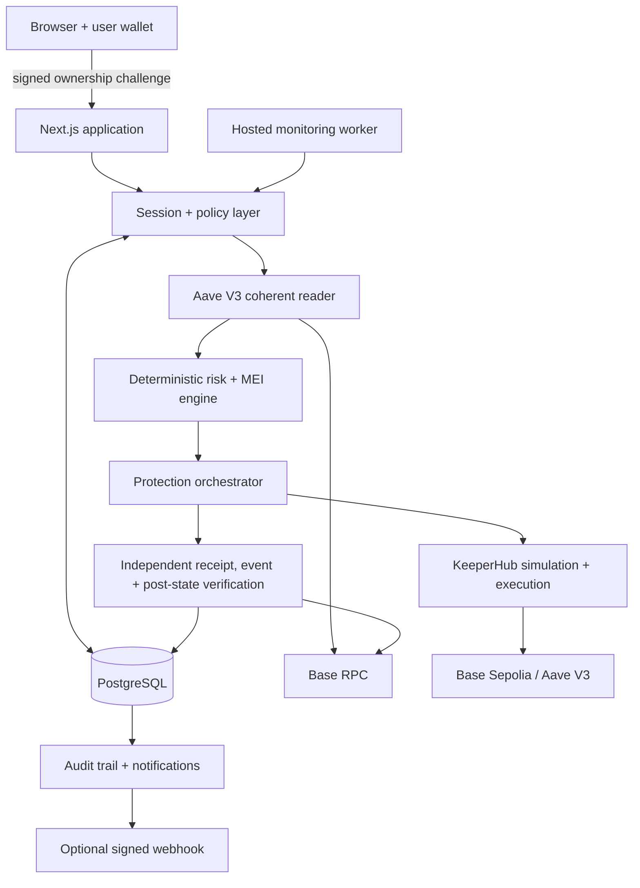

# PositionGuard

<p align="center">
  
</p>

**Autonomous Aave Position Defense**

PositionGuard is an autonomous defense layer for user-owned Aave V3 borrowing positions. It continuously reads a coherent position snapshot, classifies liquidation risk, computes the Minimum Effective Intervention (MEI) needed to reach the user's target health factor, applies the user's action and capital limits, and routes only a server-built canonical intervention through KeeperHub. A submitted transaction is not treated as success until its receipt, Aave event, and resulting position state have been independently checked.

The hackathon deployment uses **Aave V3 on Base Sepolia**. Testnet assets have no real-world value.

- **Live application:** [positionguard.online](https://positionguard.online)
- **Technical architecture:** [docs/architecture.md](docs/architecture.md)
- **Main Track evidence:** [docs/judging-criteria.md](docs/judging-criteria.md)
- **Watch the PositionGuard demo:** [Click here](https://youtu.be/gY-vJ8RZNS4)

## The problem

An Aave borrower must keep track of health factor, collateral prices, debt exposure, available intervention capital, and timing. A simplistic automation rule is unsafe: the position can change after analysis; a bot can over-repay, consume too much collateral, violate the user's policy, lack balance or allowance, duplicate a request, or mistake a submitted or reverted transaction for successful protection.

PositionGuard addresses both halves of the problem: deciding what the smallest permitted response is, and proving that the intended response actually happened.

## The solution

```text
Wallet connection
  → signed ownership verification
  → Aave position detection
  → user protection policy
  → hosted monitoring worker
  → block-pinned Aave snapshot
  → risk classification and candidate generation
  → Minimum Effective Intervention
  → policy, funding, and allowance checks
  → KeeperHub simulation
  → immediate canonical revalidation
  → KeeperHub broadcast
  → receipt and Aave-event verification
  → post-execution health-factor verification
  → audit trail and notifications
```

This is more than an alerting dashboard or a fixed auto-repay rule. PositionGuard determines and constrains the intervention. KeeperHub provides the controlled simulation and execution route. PositionGuard then verifies the result independently over RPC. If the live policy, selected effect, or position changes during preparation, the stale intervention is cancelled instead of being sent.

## Minimum Effective Intervention (MEI)

For every supported reserve in the position, the deterministic engine considers two protocol-specific effects:

- **Repay debt:** reduce variable debt for the protected account.
- **Add collateral:** supply an already eligible collateral asset on behalf of the protected account.

The engine projects the health factor for candidate token amounts, checks whether each candidate reaches the configured target, applies the saved policy and funding constraints, then ranks valid candidates by exact capital value. A bounded binary search finds the smallest effective amount at the asset's token-unit precision. The selected MEI is therefore the smallest evaluated, permitted single action expected to restore the target under the captured Aave state—not a claim of global optimization across swaps, multi-action portfolios, gas, or future price changes.

Candidates and their projected HF, estimated capital, policy status, approval status, and rejection reasons are persisted and shown on the Protection page. The deterministic engine is authoritative; AI cannot select or change the action.

## Aave V3 integration

The server-side Aave reader obtains and normalizes:

- account collateral, debt, available borrows, health factor, LTV, and eMode;
- supplied, variable-debt, and stable-debt balances by reserve;
- wallet balances, token decimals, and oracle prices;
- collateral-enabled state and each reserve's liquidation threshold;
- active, paused, frozen, isolation, and supply-cap information; and
- the configured Pool, Pool Data Provider, Addresses Provider, and oracle relationships.

All reads for a snapshot are pinned to one block. The block hash is checked again before accepting the observation. Reconciliation failures and unsupported eMode, stable-debt, or isolation estimation fail closed instead of producing an unsafe intervention.

Execution support is intentionally narrower than read discovery: the current canonical action allowlist is USDC and WETH on configured Base networks, using Aave V3 `repay(..., onBehalfOf)` or `supply(..., onBehalfOf)`. The hackathon evidence and default environment are Base Sepolia (chain `84532`). See [Aave integration](docs/aave-integration.md).

## KeeperHub integration

KeeperHub is the execution infrastructure, not a substitute RPC endpoint. PositionGuard:

1. authenticates with a server-only organization API key;
2. verifies the organization wallet, expected execution-wallet pin, chain support, and disclosed capabilities;
3. submits the exact canonical Aave call in simulation mode;
4. requires a successful non-reverting simulation with the expected sender and target;
5. broadcasts with a durable idempotency key only after canonical revalidation;
6. persists the KeeperHub execution ID and polls execution status; and
7. requires verified KeeperHub receipt evidence before performing independent RPC and Aave checks.

The browser may request only a mode (`simulate` or, for the operator-only endpoint, `broadcast`). It cannot provide a target, calldata, ABI, function, asset, token address, amount, sender, or beneficiary. Those fields are rebuilt on the server from the current policy, live Aave state, allowlists, and configured execution wallet.

For interactive/operator broadcast, the normal operator credential is insufficient on its own: a separate short-lived effect-bound authorization derived from `POSITIONGUARD_BROADCAST_TOKEN` is required. The worker uses a separate server-only autonomous entry point; it can broadcast only when the persisted policy is enabled in `AUTONOMOUS` mode and after the same revalidation, funding, allowance, simulation, idempotency, and verification sequence.

See [KeeperHub integration](docs/keeperhub-integration.md) and [the execution-wallet model](docs/execution-wallet-model.md).

## Verified KeeperHub execution

The repository's canonical persisted historical record documents one confirmed Base Sepolia protection:

| Evidence               | Value                                                                                                                |
| ---------------------- | -------------------------------------------------------------------------------------------------------------------- |
| Before HF              | `1.549918707188866008`                                                                                               |
| Selected intervention  | Repay `0.212852 USDC`                                                                                                |
| KeeperHub execution ID | `r2glntpejp16jxatt6th8`                                                                                              |
| Transaction            | [`0xc140…d7ba1`](https://sepolia.basescan.org/tx/0xc140daf6aed1e8e0623eaadbaee7dee5a59ffe860c9bd576d606401d761d7ba1) |
| After HF               | `1.599999884615885683`                                                                                               |

During the documentation audit, a read-only Base Sepolia RPC check independently confirmed that the transaction succeeded at block `46623821`. The Aave V3 Pool `Repay` event records `212852` units of the configured six-decimal USDC for the protected account, with the configured KeeperHub execution wallet as repayer. The transaction and Aave repayment event are independently verifiable on Base Sepolia, while the before/after health factor and KeeperHub execution ID are persisted as PositionGuard application evidence.

The Dashboard, Protection, and Activity views do not contain hardcoded success values. They select a `CONFIRMED`, `receiptVerified` execution and its related decision/snapshot from PostgreSQL. A currently safe position may correctly show **No action required** while this separately labeled historical execution remains visible.

## Autonomous protection

The worker runs independently of the browser and enumerates every enabled protected account. It refreshes Aave state, records the monitoring run and decision, recomputes MEI, checks execution-wallet funding and Pool allowance, and applies the policy's execution mode:

| UI mode               | Stored mode        | Current behavior                                                                                                                         |
| --------------------- | ------------------ | ---------------------------------------------------------------------------------------------------------------------------------------- |
| Monitor Only          | `MONITOR_ONLY`     | Observe, classify, persist, and notify; do not simulate or broadcast.                                                                    |
| Ask Before Acting     | `REQUIRE_APPROVAL` | Check readiness and simulate an eligible candidate; persist an approval-required state and stop. User-session requests cannot broadcast. |
| Protect Automatically | `AUTONOMOUS`       | After explicit enablement confirmation, enter the server-only autonomous orchestrator and broadcast only if every safety gate passes.    |

`MONITOR_POLL_INTERVAL_MS` controls the cycle interval and is clamped to at least 30 seconds. A database heartbeat is written every 10 seconds. The UI reports `ONLINE`, `DEGRADED`, `OFFLINE`, or `NOT_STARTED` from heartbeat age. Each account failure is contained so the worker can continue processing other accounts.

## Safety model

Implemented safeguards include:

- signed wallet-ownership challenge with expiry and one-time nonce consumption;
- database-backed, hashed session tokens in HTTP-only SameSite cookies;
- wallet and chain scoping for product APIs and stored data;
- strict threshold ordering, allowed actions, per-action limit, rolling 24-hour spend, approval threshold, and cooldown;
- exact execution-wallet sender pin, token balance, and bounded Pool allowance checks;
- server-generated allowlisted Aave intent and strict request schemas;
- KeeperHub simulation before broadcast;
- immediate policy/position/candidate fingerprint revalidation and stale cancellation;
- unique database idempotency key plus an atomic `NOT_STARTED` → `SUBMITTED` claim;
- KeeperHub status/receipt validation, independent RPC receipt and Aave event verification, and post-state HF improvement check;
- persisted failed/unconfirmed states, audit events, notifications, and fail-closed errors; and
- advisory-only AI with schema validation and deterministic fallback.

PositionGuard does not create token approvals. It requires an existing allowance sufficient for the exact bounded action. See [the full safety model](docs/safety-model.md) and [security notes](docs/security.md).

## Scenario / stress testing

The Scenario page applies a user-selected collateral-price drop to the latest persisted position snapshot and runs the same deterministic engine against the stressed portfolio. It shows current HF, stressed HF, risk level, proposed MEI, projected recovery HF, and estimated capital.

This feature is **simulation only**: it does not write on-chain state, submit a blockchain transaction, or change the live monitoring snapshot or policy.

## AI explanation layer

An optional provider may explain the risk state, chosen engine candidate, policy constraints, rejected candidates, and verified outcome. Provider output must pass a strict Zod schema and may reference only candidate IDs produced by the deterministic engine. A timeout, malformed response, or unknown candidate falls back to deterministic text.

AI has no path to change the amount, policy, calldata, ABI, target, sender, beneficiary, or broadcast decision.

## Notifications and auditability

Monitoring snapshots, threshold crossings, candidate evaluation, MEI selection, policy and mode updates, stale cancellation, blocked actions, execution states, receipt verification, Aave-event confirmation, failures, and verified outcomes are persisted.

The notification center provides **Meaningful** and **All notifications** views with Risk, Recommendations, Executions, Failures, Delivery, and System filters. Semantically unchanged MEI recalculations and related execution events are grouped without deleting their underlying records; the UI renders 25 items at a time with **Load 25 more**.

In-app notification persistence happens before optional webhook delivery. A webhook failure is recorded as delivery failure and does not turn a successful product execution into a failed execution; the in-app record remains available. See [observability](docs/observability.md).

## Architecture



The browser controls wallet consent and policy configuration, but never transaction construction. The server and worker are the execution trust boundary. PostgreSQL holds policy, decision, execution, monitoring, session, audit, and notification state.

## Tech stack

- Next.js 16, React 19, TypeScript 5
- PostgreSQL with Prisma 7
- viem for EVM reads, encoding, receipts, and event decoding
- Zod for request, policy, and external-response validation
- Vitest and ESLint
- Docker and Docker Compose on a VPS
- Aave V3 and KeeperHub on Base Sepolia

## Repository structure

| Path                    | Responsibility                                                           |
| ----------------------- | ------------------------------------------------------------------------ |
| `src/app`               | App Router pages and wallet-scoped API routes                            |
| `src/components`        | Onboarding, policy, execution, funding, monitoring, and notification UI  |
| `src/lib/aave`          | Coherent Aave reads, normalization, funding/allowance checks, intents    |
| `src/lib/protection`    | Risk, candidates, MEI estimation, ranking, stress analysis inputs        |
| `src/lib/execution`     | Preparation, revalidation, authorization, idempotency, verification      |
| `src/lib/keeperhub`     | Authenticated reads, direct simulation/broadcast/status adapter          |
| `src/lib/monitoring`    | Hosted worker lifecycle, account cycles, heartbeat, structured logs      |
| `src/lib/notifications` | Persistence, webhooks, deduplication, grouping, filters                  |
| `src/lib/security`      | Wallet ownership, sessions, origin checks, operator boundary             |
| `prisma`                | Schema and migrations                                                    |
| `scripts`               | Worker, environment, RPC, Aave, KeeperHub, DB, and readiness checks      |
| `tests`                 | Unit and integration suites                                              |
| `docs`                  | Architecture, safety, deployment, testing, demo, and submission material |

### Product routes

| Route            | Purpose                                                                       |
| ---------------- | ----------------------------------------------------------------------------- |
| `/onboarding`    | Wallet connection, signed ownership verification, and Aave position detection |
| `/dashboard`     | Current position, risk, monitoring, and latest verified protection summary    |
| `/position`      | Aave collateral, debt, reserve, and snapshot details                          |
| `/protection`    | MEI candidates, readiness, simulation/current state, and historical execution |
| `/scenario`      | Simulation-only collateral-price stress testing                               |
| `/activity`      | Audit and execution timeline                                                  |
| `/notifications` | Meaningful/all views, category filters, and delivery state                    |
| `/settings`      | Policy, limits, actions, cooldown, and execution mode                         |
| `/dev/aave`      | Operator-only engineering verifier                                            |

## Getting started

Requirements: Node `>=24 <26` (the repository `.nvmrc` selects Node 24), npm, and PostgreSQL.

```sh
nvm use
npm ci
cp .env.example .env
# Configure a reachable PostgreSQL database and required server-only values.
npm run db:generate
npm run db:migrate
npm run dev
```

Open `http://localhost:3000`. Unauthenticated users are redirected to `/onboarding`; the wallet flow then opens the product at `/dashboard`.

The provided Compose deployment expects an external PostgreSQL database; it does not define a local `postgres` service. See [VPS deployment](docs/vps-deployment.md).

## Environment variables

Do not commit `.env`, and never expose the following values through `NEXT_PUBLIC_*`.

| Category                | Variables                                                                                       | Purpose                                                                                                                           |
| ----------------------- | ----------------------------------------------------------------------------------------------- | --------------------------------------------------------------------------------------------------------------------------------- |
| Database                | `DATABASE_URL`, `DATABASE_TLS_ALLOW_SELF_SIGNED`                                                | PostgreSQL connection; self-signed TLS escape hatch is development-only.                                                          |
| Aave / RPC              | `BASE_SEPOLIA_RPC_URL`, `BASE_RPC_URL`, `POSITIONGUARD_DEFAULT_CHAIN_ID`, `AAVE_WALLET_ADDRESS` | Server-side chain reads and CLI/default worker account selection.                                                                 |
| KeeperHub               | `KEEPERHUB_API_KEY`, `KEEPERHUB_BASE_URL`, `KEEPERHUB_EXECUTION_WALLET`                         | Organization authentication, restricted official origin, expected execution sender.                                               |
| Execution authorization | `POSITIONGUARD_BROADCAST_TOKEN`, `POSITIONGUARD_DEV_TOKEN`                                      | Separate operator broadcast step-up secret and development/operator API token. The latter also signs short-lived scenario grants. |
| Monitoring              | `MONITOR_POLL_INTERVAL_MS`, `WORKER_NAME`, `WORKER_ENVIRONMENT`, `WORKER_HEARTBEAT_PATH`        | Poll interval, heartbeat identity/namespace, and container health file.                                                           |
| Notifications           | `POSITIONGUARD_WEBHOOK_URL`, `POSITIONGUARD_WEBHOOK_SECRET`                                     | Optional persisted-notification webhook and HMAC signing secret.                                                                  |

There is no AI provider credential in the current environment contract; the explanation module accepts an optional server-side provider and otherwise uses deterministic fallback.

## Verification commands

All commands below are from `package.json`. None of the verification scripts broadcasts a transaction.

| Command                                     | What it verifies                                                                                                                    |
| ------------------------------------------- | ----------------------------------------------------------------------------------------------------------------------------------- |
| `npm run verify:env`                        | Required configuration formats without printing secrets.                                                                            |
| `npm run verify:rpc`                        | RPC chain, Aave deployments/provider links, oracle base unit, allowlisted reserves, and token metadata.                             |
| `npm run verify:aave -- [wallet] [chainId]` | Live coherent Aave position read (`verify:network` is the same script).                                                             |
| `npm run verify:keeperhub`                  | Authentication, chain catalog, wallet/profile match, sender pin, and key capabilities; it does **not** prove broadcast.             |
| `npm run verify:allowance -- USDC 0.212852` | Read-only execution-wallet balance/Pool allowance comparison for an explicit amount.                                                |
| `npm run verify:db`                         | Database connectivity and temporary create/read/delete probe.                                                                       |
| `npm run verify:autonomous`                 | Live policy, monitoring persistence, readiness, stress analysis, and KeeperHub **simulation**; reports `broadcastAttempted: false`. |
| `npm run lint`                              | ESLint checks.                                                                                                                      |
| `npm run typecheck`                         | Strict TypeScript compilation without output.                                                                                       |
| `npm test`                                  | Vitest suite.                                                                                                                       |
| `npm run db:validate`                       | Prisma schema validation.                                                                                                           |
| `npm run db:generate`                       | Prisma client generation.                                                                                                           |
| `npm run build`                             | Production Next.js build.                                                                                                           |

`npm run worker:monitor -- --once` performs a real monitoring cycle and may simulate in Ask Before Acting mode or autonomously execute when an enabled policy is explicitly set to Protect Automatically. It is operational, not a routine read-only verification command.

## VPS deployment

Production Compose builds one image and runs it as two supervised services:

- `web`: standalone Next.js bound to loopback, with a database-backed `/api/health` check;
- `worker`: long-running monitoring process with database and file heartbeats; and
- external PostgreSQL, plus the already configured reverse proxy/TLS layer.

Both containers use `restart: unless-stopped`. Deployments apply migrations, recreate services when code or environment changes, and check web/worker health and structured logs. Full commands are in [docs/vps-deployment.md](docs/vps-deployment.md).

## Known limitations

- The intervention engine is specific to Aave V3; it is not universal DeFi automation.
- Canonical execution is limited to configured USDC/WETH repay and already-enabled collateral-supply actions on Base networks.
- eMode, stable-debt, isolation, reconciliation failures, and unsupported reserve conditions block MEI execution.
- MEI is a single-action, current-state estimate. It does not optimize swaps, gas, future prices, or multi-step strategies.
- Ask Before Acting stops after successful simulation; the current wallet-session UI does not expose a user-confirmed broadcast path.
- The post-state verifier requires HF improvement but does not require exact equality with the projected or target HF, because on-chain accrual and rounding can differ.
- Webhook delivery requires a configured external endpoint; email has only a provider interface.
- The in-process authentication rate limiter is per application process, not a shared distributed limiter.
- Base Sepolia is the hackathon environment and its assets have no real-world value. Base mainnet is configured but no mainnet execution is claimed.
- PositionGuard has not undergone a formal third-party security audit.

## Hackathon

| Field                    | Submission                              |
| ------------------------ | --------------------------------------- |
| Event                    | KeeperHub – The Agent Economy Hackathon |
| Track                    | Best Integration into a Live Project    |
| Integrated project       | Aave V3                                 |
| Execution infrastructure | KeeperHub direct execution              |
| Network                  | Base Sepolia                            |

See the [submission summary](docs/submission.md), [judge-facing criteria map](docs/judging-criteria.md), and [demo walkthrough](docs/demo.md).
