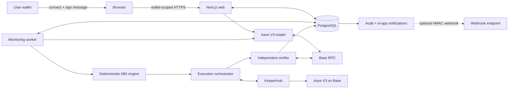
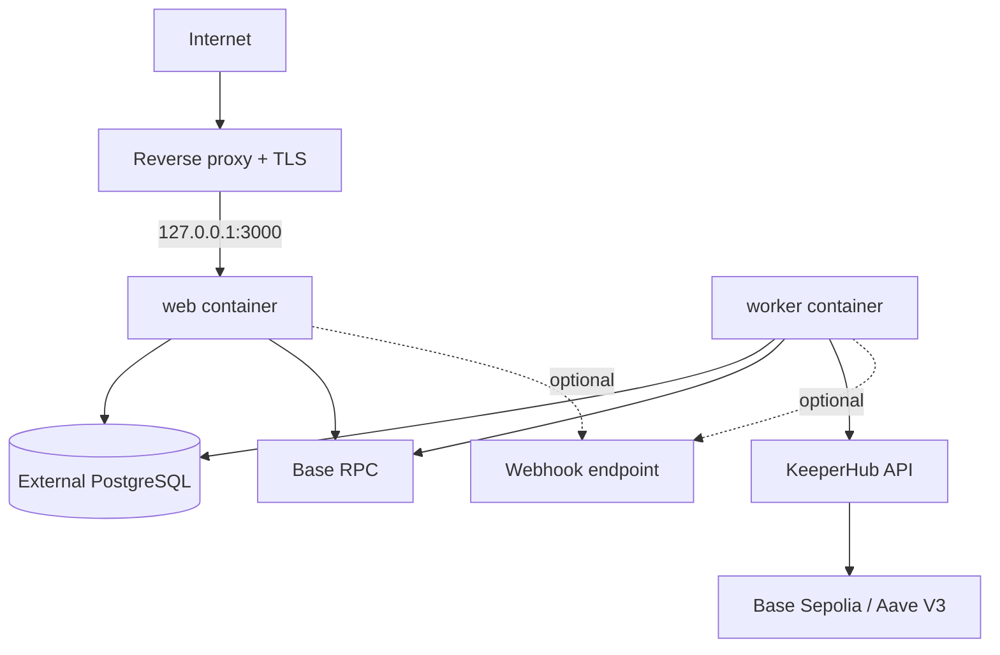

# PositionGuard architecture

## System overview

PositionGuard protects a user-owned Aave V3 borrowing position through a closed **observe → decide → execute → verify** lifecycle. The browser establishes ownership and configures policy. A hosted worker reads Aave independently of the browser, invokes the deterministic decision engine, and—only for an explicitly enabled autonomous policy—uses KeeperHub to execute a canonical Aave intervention. PostgreSQL is the durable coordination and evidence layer.

The default hackathon network is Base Sepolia (84532). Base mainnet is configured separately, but no mainnet execution is claimed.



## Components

| Component              | Responsibility                                                                                   | Authority                                                                     |
| ---------------------- | ------------------------------------------------------------------------------------------------ | ----------------------------------------------------------------------------- |
| User wallet            | Select account and sign an ownership challenge.                                                  | Proves account control; the sign-in message does not authorize a transaction. |
| Browser / Next.js UI   | Onboarding, policy, position, protection, scenario, activity, and notification views.            | May request wallet-scoped operations; cannot construct execution fields.      |
| Wallet/session layer   | Nonce challenge, signature verification, hashed session token, origin and account scoping.       | Authoritative for user-facing resource access.                                |
| Aave V3 reader         | Verify configured contracts and capture block-pinned account/reserve/oracle state.               | Authoritative source for observed protocol state.                             |
| Deterministic engine   | Classify risk, generate candidates, estimate effects, enforce policy, select MEI.                | Sole decision authority. AI is advisory only.                                 |
| Monitoring worker      | Enumerate enabled policies, run cycles, apply execution modes, write heartbeat/logs.             | Server-side automation independent of a browser session.                      |
| Execution orchestrator | Prepare intent, verify sender/funds/allowance, simulate, revalidate, reserve, broadcast, verify. | Sole transaction lifecycle authority.                                         |
| KeeperHub adapter      | Authenticated simulation, direct contract-call broadcast, status, receipt parsing.               | Controlled execution transport.                                               |
| Independent verifier   | Fetch RPC evidence, decode the exact Aave event, re-read post-state.                             | Determines whether execution can be confirmed.                                |
| PostgreSQL / Prisma    | Sessions, policies, snapshots, decisions, executions, monitoring, audit, notifications.          | Durable state and idempotency/evidence store.                                 |

## Trust boundaries

### Browser to server

Wallet-session APIs derive the protected account and chain from the verified session. The execution request accepts only a simulation or broadcast mode. Target, ABI, function, calldata, asset, token address, amount, sender, and beneficiary are rejected.

A wallet session can request simulation but cannot broadcast. The operator broadcast path also requires the development/operator bearer credential and a separate broadcast token. The autonomous worker does not accept browser input; its authority comes from an explicitly confirmed, enabled AUTONOMOUS database policy.

### Server to Aave

RPC URLs and contract configuration remain server-only. Every coherent read verifies chain ID, deployed code, provider links, oracle base unit, reserve membership, token metadata, and block hash. Position inputs are reconstructed from Aave rather than accepted from the UI.

### Server to KeeperHub

The API key never reaches the browser. The adapter restricts the KeeperHub origin, rejects redirects, validates response schemas, pins the organization wallet, and submits only server-built Aave repay or supply calls.

### AI boundary

The optional provider receives bounded summaries and engine candidate IDs. Its output is schema-validated and explanatory only. It cannot influence policy, amounts, canonical intent, authorization, or broadcast.

## End-to-end data flow

```mermaid
sequenceDiagram
  participant User
  participant Browser
  participant Web as Next.js
  participant DB as PostgreSQL
  participant Worker
  participant Aave as Aave/RPC
  participant Engine as MEI engine
  participant KH as KeeperHub

  User->>Browser: Connect wallet
  Browser->>Web: Request challenge
  Web->>DB: Persist expiring nonce hash
  User->>Browser: Sign ownership message
  Browser->>Web: Submit signature
  Web->>DB: Consume nonce; create hashed session
  Web->>Aave: Detect position at one block
  Web->>DB: Persist initial snapshot and policy

  loop configured monitoring interval
    Worker->>DB: Load enabled protected accounts
    Worker->>Aave: Capture coherent live position
    Worker->>Engine: Risk + candidates + MEI
    Worker->>DB: Persist run, snapshot, decision, candidates
    alt Monitor Only
      Worker->>DB: Audit and notify
    else Ask Before Acting
      Worker->>KH: Simulate canonical action
      Worker->>DB: Persist approval-required state
    else Protect Automatically
      Worker->>Aave: Recompute canonical intervention
      Worker->>KH: Verify sender and simulate
      Worker->>Aave: Immediate canonical revalidation
      alt state changed
        Worker->>DB: Cancel stale intervention
      else unchanged
        Worker->>KH: Broadcast with idempotency key
        Worker->>KH: Poll status and receipt
        Worker->>Aave: Verify RPC receipt, event, post-state
        Worker->>DB: Confirm or persist failure/unconfirmed state
      end
    end
  end
```

## Monitoring lifecycle

The worker is a separate long-lived process started by npm run worker:monitor. It writes a database heartbeat and optional file heartbeat every 10 seconds, loads all enabled policies, and processes accounts sequentially with per-account failure containment. It waits for MONITOR_POLL_INTERVAL_MS between cycles, clamped to at least 30 seconds.

The UI maps heartbeat age to ONLINE (up to 30 seconds), DEGRADED (over 30 seconds), OFFLINE (over 60 seconds), or NOT_STARTED.

## Decision lifecycle

1. Normalize the current Aave portfolio using exact integer/base-unit data.
2. Classify risk using target > warning > emergency > 1.
3. Generate repay-debt and eligible add-collateral candidates by reserve.
4. Find the minimum target-reaching token amount with bounded binary search.
5. Project HF and exact rational capital cost.
6. Enforce enabled state, allowed actions, balance, supply capacity, per-action cap, rolling daily cap, approval threshold, and cooldown.
7. Rank target-reaching policy-compliant candidates by capital and deterministic tie breakers.
8. Select an autonomous candidate, an approval candidate, or fail closed.

Unsupported eMode, stable debt, isolation, or account/reserve reconciliation prevents execution estimation.

## Execution lifecycle

```text
prepare live canonical intervention
  → verify KeeperHub sender and capabilities
  → verify execution-wallet token balance
  → verify exact Pool allowance
  → KeeperHub simulation
  → re-read policy, Aave state, and candidate
  → cancel if fingerprint, amount, or policy changed
  → reserve unique execution and atomically claim it
  → KeeperHub broadcast
  → poll status
```

The stable idempotency key binds wallet, chain, policy identity/version, action, asset, base-unit amount, and canonical effect fingerprint. A database unique constraint and conditional state transition prevent two workers from claiming the same execution.

Interactive/operator broadcasts require separate step-up authorization. Autonomous broadcasts are reachable only from the server-worker entry point after verifying the stored mode is AUTONOMOUS.

## Verification lifecycle

A KeeperHub completed status is insufficient. Confirmation requires:

1. KeeperHub receipt evidence on the expected chain;
2. verified and successful receipt status with one consistent hash;
3. a successful independent RPC receipt at the reported block;
4. an exact Aave Pool Repay or Supply event matching reserve, beneficiary, and amount;
5. the expected repayer for repayment;
6. a new block-pinned Aave position read; and
7. HF improvement when both before and after HF are finite.

Only then does the database set the execution to CONFIRMED with receiptVerified true, save a post-execution snapshot, complete the decision, and append verification audit events.

## Notification lifecycle

A notification row is created before external delivery. Its unique dedupe key prevents repeated delivery of the same semantic event. If a webhook is configured, PositionGuard sends a versioned JSON body with an optional HMAC-SHA256 signature and an eight-second timeout. Delivery becomes DELIVERED or FAILED; absent configuration becomes SKIPPED.

The in-app event remains if delivery fails. Meaningful view grouping collapses unchanged MEI recalculations and related execution events without deleting records. Category filters and 25-item presentation pagination support investigation.

## Database role

The [Prisma schema](../prisma/schema.prisma) defines users, one-time challenges, revocable sessions, wallet/chain policies, block-attributed snapshots, decisions and ordered candidates, unique idempotent executions, monitoring runs, worker heartbeats, audit events, and notifications.

Transactions protect challenge consumption/session creation, execution reservation, and confirmed-execution persistence. Audit events are application-managed records; the schema does not claim cryptographic tamper evidence or database-enforced append-only storage.

## Failure behavior

PositionGuard fails closed when authentication, policy, analysis support, RPC coherence, sender identity, funding, allowance, simulation, revalidation, idempotency claim, receipt validation, Aave event matching, or post-state improvement fails.

- **Cancelled/stale:** the canonical effect changed; no broadcast.
- **Blocked:** a policy or readiness gate prevented progress.
- **Unconfirmed:** submission or terminal evidence is ambiguous; no success claim.
- **Failed:** execution or verification reached a terminal failure.
- **Confirmed:** KeeperHub evidence, RPC/Aave effect, and post-state passed.

A webhook failure changes only delivery state. An account-cycle failure is persisted and notified while other accounts continue.

## Deployment topology



Compose runs web and worker with restart: unless-stopped. Web health calls the database-backed /api/health; worker health checks a heartbeat file. PostgreSQL is external to Compose. See [VPS deployment](vps-deployment.md).
